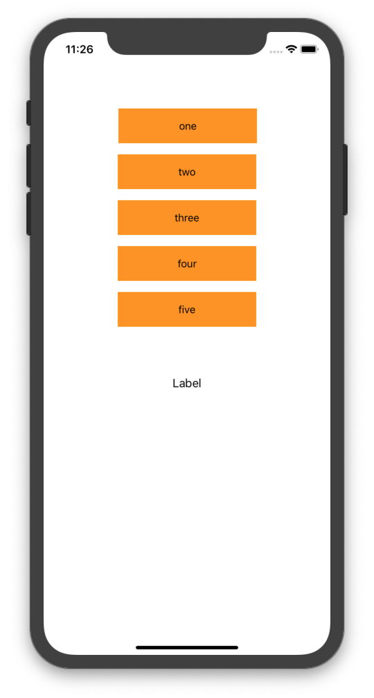

# SwitchIfSpeedTest

Which one is faster⚡️? `switch` or `if`?

> '조건이 세 개 이상일 때 switch가 빠르고, 두 개일 때는 if가 빠르다'라는 말을 들었다.
> 정말일까? if는 switch와 달리 비교 기준을 set해서 패턴을 매칭시키는 과정이 없어서 초반에는 더 빠를거 같은데,
> switch는 if와 달리 계속해서 조건을 검사하지 않아도 되니깐 후반부에서는 더 빠를거 같다. 검증 해보자. 😇

#### 다섯 개의 버튼을 만들어 각각 탭 이후 액션을 타고 switch와 if의 분기 종료까지 걸리는 시간을 비교 해본다.<br>

<p align="center">

</p>

## if
```swift
  @objc func didButtonsTap(_ sender: UIButton) {
    currentTime("\nstart", isStart: true)
    label.text = sender.titleLabel?.text
    
    // TEST: IF
    if sender == self.buttonOne {
      currentTime("end_1")
    } else if sender == self.buttonTwo {
      currentTime("end_2")
    } else if sender == self.buttonThree {
      currentTime("end_3")
    } else if sender == self.buttonFour {
      currentTime("end_4")
    } else if sender == self.buttonFive {
      currentTime("end_5")
    }
  
    timeGap()
  }
```
start: 43:38:96590995<br>
end_1: 43:38:98299026<br>
time_gap:  **1708031**<br>

start: 43:44:757321000<br>
end_2: 43:44:757444977<br>
time_gap:  **123977**<br>

start: 43:46:714946031<br>
end_3: 43:46:715088009<br>
time_gap:  **141978**<br>

start: 43:50:753780961<br>
end_4: 43:50:753903985<br>
time_gap:  **123024**<br>

start: 43:52:643730044<br>
end_5: 43:52:643854975<br>
time_gap:  **124931**<br>


## switch
```swift
  @objc func didButtonsTap(_ sender: UIButton) {
    currentTime("\nstart", isStart: true)
    label.text = sender.titleLabel?.text
    
    // TEST: SWITCH
        switch sender {
        case buttonOne:
          currentTime("end_1")
        case buttonTwo:
          currentTime("end_2")
        case buttonThree:
          currentTime("end_3")
        case buttonFour:
          currentTime("end_4")
        case buttonFive:
          currentTime("end_5")
        default: break
        }
    
    timeGap()
  }
```
start: 48:11:375694990<br>
end_1: 48:11:377637982<br>
time_gap:  **1942992**<br>

start: 48:12:39389014<br>
end_2: 48:12:39513945<br>
time_gap:  **124931**<br>

start: 48:12:737220048<br>
end_3: 48:12:737339019<br>
time_gap:  **118971**<br>

start: 48:13:367521047<br>
end_4: 48:13:367642998<br>
time_gap:  **121951**<br>

start: 48:14:8321046<br>
end_5: 48:14:8442044<br>
time_gap:  **120998**<br>

## Result

**🚩Case 1:**<br>
**if**의 타임 갭이 1708031로<br>
switch의 1942992보다<br>
**234961 nanosec 빠르다**<br>

**🚩Case 2:**<br>
**if**의 타임 갭이 123977로<br>
switch의 124931보다<br>
**954 nanosec 빠르다**<br>

**🚩Case 3:**<br>
**switch**의 타임 갭이<br> 
118971로 if의 141978보다<br> 
**23007 nanosec 빠르다**<br>

**🚩Case 4:**<br>
**switch**의 타임 갭이 121951로<br> 
if의 123024보다<br>
**1073 nanosec 빠르다**<br>

**🚩Case 5:**<br>
**switch**의 타임 갭이 120998로<br> 
if의 124931보다<br>
**3933 nanosec 빠르다**

### 💡'조건이 세 개 이상일 때 switch가 빠르고, 두 개일 때는 if가 빠르다'는 사실로 밝혀졌다.
첫 번째, 두 번째 조건은 if가 확실히 빠르지만, 세 번째 부터의 조건들은 switch가 빠르다는 결과를 확인하였다.
